# Implicit3DUnderstanding (Im3D) [[Project Page (with interactive results)]](https://chengzhag.github.io/publication/im3d/)[[Paper]](https://arxiv.org/pdf/2103.06422)[[Video]](https://www.youtube.com/watch?v=Kg0du7mFu60)

### Holistic 3D Scene Understanding from a Single Image with Implicit Representation
Cheng Zhang*, Zhaopeng Cui*, Yinda Zhang*, Shuaicheng Liu, Bing Zeng, Marc Pollefeys

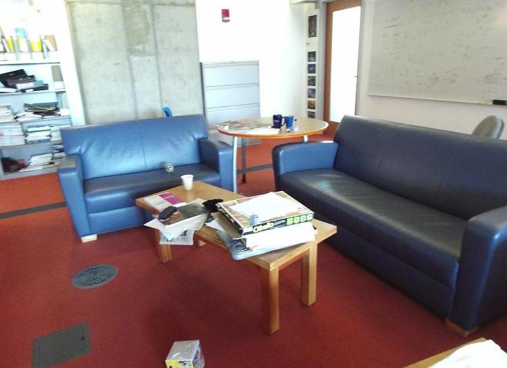 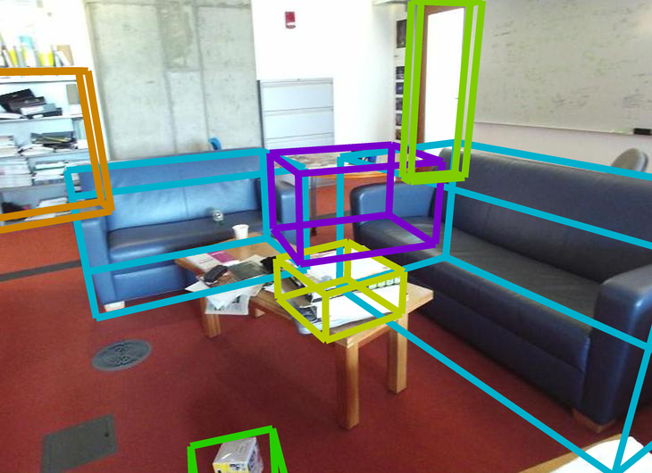 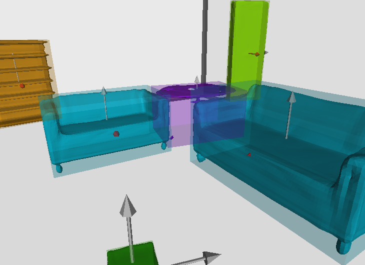 <br>
 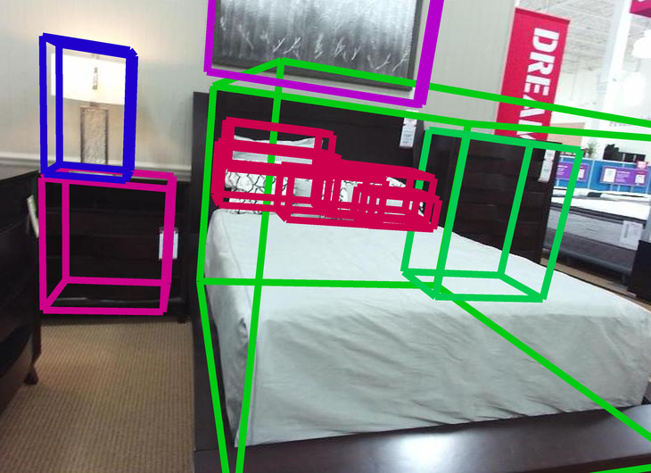 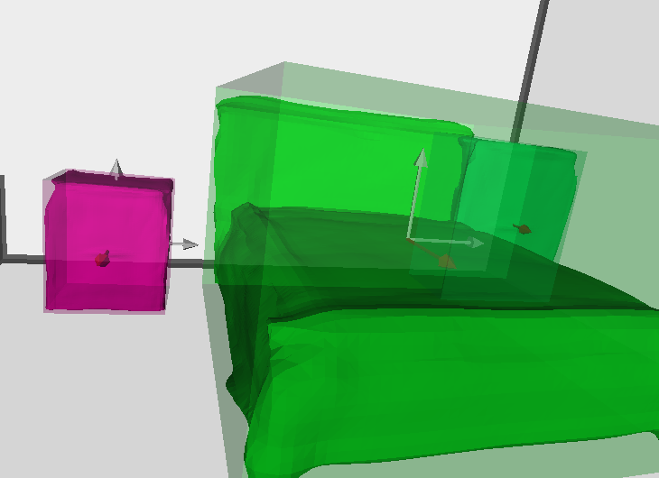 <br>
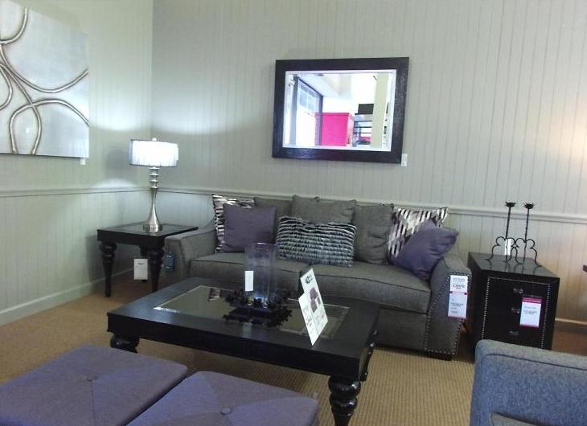 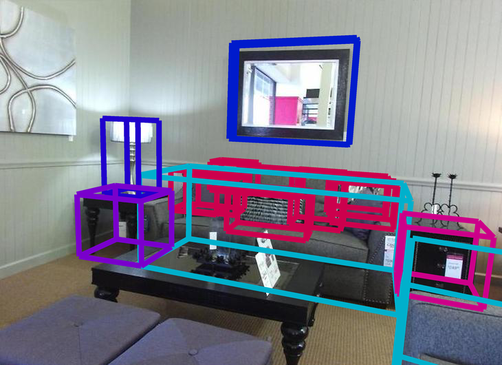 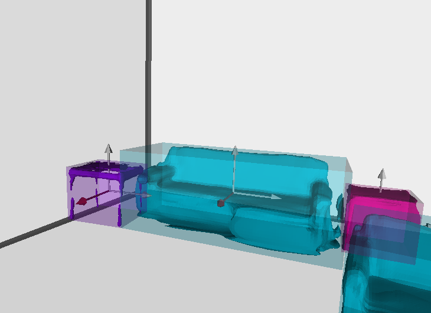

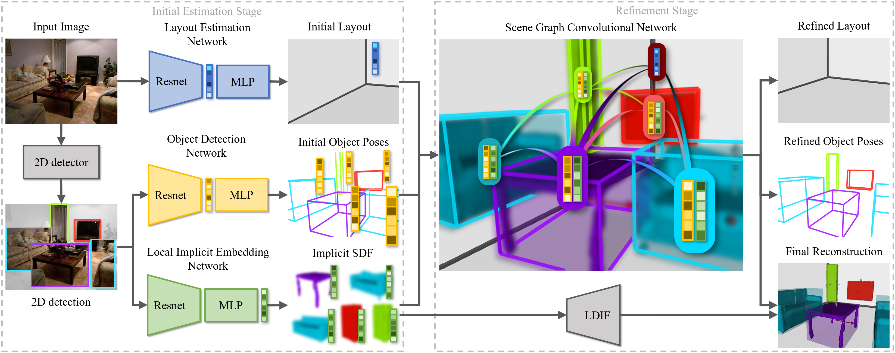


## Introduction

This repo contains training, testing, evaluation, visualization code of our CVPR 2021 paper.
Specially, the repo contains our PyTorch implementation of the decoder of [LDIF](https://github.com/google/ldif), which can be extracted and used in other projects.


## Install

Please make sure to install CUDA NVCC on your system first. then run the following:
```
sudo apt install xvfb ninja-build freeglut3-dev libglew-dev meshlab
conda env create -f environment.yml
conda activate Im3D
python project.py build
```
When running ```python project.py build```, the script will run ```external/build_gaps.sh``` which requires password for sudo privilege for ```apt-get install```.
Please make sure you are running with a user with sudo privilege.
If not, please reach your administrator for installation of [these libraries](https://github.com/chengzhag/Implicit3DUnderstanding/blob/af2964f074d941cd990cff81a9b5f75489586ed2/external/build_gaps.sh#L37) and comment out the corresponding lines then run ```python project.py build```.

## Demo
1. Download the [pretrained checkpoint](https://stduestceducn-my.sharepoint.com/:u:/g/personal/2015010912010_std_uestc_edu_cn/Efs2Tqlkk_pIhy16ud20m5sBMkbkWJEuspiLjdF4G2jOzA?e=sxnswk)
and unzip it into ```out/total3d/20110611514267/```

2. Change current directory to ```Implicit3DUnderstanding/``` and run the demo, which will generate 3D detection result and rendered scene mesh to ```demo/output/1/```
    ```
    CUDA_VISIBLE_DEVICES=0 python main.py out/total3d/20110611514267/out_config.yaml --mode demo --demo_path demo/inputs/1
    ```
   
3. In case you want to run it off screen (for example, with SSH)
    ```
    CUDA_VISIBLE_DEVICES=0 xvfb-run -a -s "-screen 0 800x600x24" python main.py out/total3d/20110611514267/out_config.yaml --mode demo --demo_path demo/inputs/1
    ```
   
4. If you want to run it interactively, change the last line of demo.py
    ```
    scene_box.draw3D(if_save=True, save_path = '%s/recon.png' % (save_path))
    ```
    to
    ```
    scene_box.draw3D(if_save=False, save_path = '%s/recon.png' % (save_path))
    ```


## Data preparation
We follow [Total3DUnderstanding](https://github.com/yinyunie/Total3DUnderstanding) to use [SUN-RGBD](https://rgbd.cs.princeton.edu/) to train our Scene Graph Convolutional Network (SGCN), and use [Pix3D](http://pix3d.csail.mit.edu/) to train our Local Implicit Embedding Network
(LIEN) with [Local Deep Implicit Functions](https://github.com/google/ldif) (LDIF) decoder.

#### Preprocess SUN-RGBD data

Please follow [Total3DUnderstanding](https://github.com/yinyunie/Total3DUnderstanding) to directly download the processed train/test data.

In case you prefer processing by yourself or want to evaluate 3D detection with our code
(To ultilize the evaluation code of [Coop](https://github.com/thusiyuan/cooperative_scene_parsing), we modified the data processing code of Total3DUnderstanding to save parameters for transforming the coordinate system from Total3D back to Coop),
please follow these steps:

1. Follow [Total3DUnderstanding](https://github.com/yinyunie/Total3DUnderstanding) to download the raw data.

2. According to [issue #6](https://github.com/yinyunie/Total3DUnderstanding/issues/6) of [Total3DUnderstanding](https://github.com/yinyunie/Total3DUnderstanding),
there are a few typos in json files of SUNRGBD dataset, which is mostly solved by the json loader.
However, one typo still needs to be fixed by hand.
Please find ```{"name":""propulsion"tool"}``` in ```data/sunrgbd/Dataset/SUNRGBD/kv2/kinect2data/002922_2014-06-26_15-43-16_094959634447_rgbf000089-resize/annotation2Dfinal/index.json``` and remove ```""propulsion```.

3. Process the data by
    ```
    python -m utils.generate_data
    ```

#### Preprocess Pix3D data
We use a different data process pipeline with [Total3DUnderstanding](https://github.com/yinyunie/Total3DUnderstanding). Please follow these steps to generate the train/test data:

1. Download the [Pix3D dataset](http://pix3d.csail.mit.edu/) to ```data/pix3d/metadata```

2. Run below to generate the train/test data into 'data/pix3d/ldif'
    ```
    python utils/preprocess_pix3d4ldif.py
    ```


## Training and Testing
We use [wandb](https://www.wandb.com/) for logging and visualization.
You can register a wandb account and login before training by ```wandb login```.
In case you don't need to visualize the training process, you can put ```WANDB_MODE=dryrun``` before the commands bellow.

Thanks to the well-structured code of [Total3DUnderstanding](https://github.com/yinyunie/Total3DUnderstanding), we use the same method to manage parameters of each experiment with configuration files (```configs/****.yaml```).
We first follow [Total3DUnderstanding](https://github.com/yinyunie/Total3DUnderstanding) to pretrain each individual module, then jointly finetune the full model with additional physical violation loss.

#### Pretraining
We use the [pretrained checkpoint](https://livebournemouthac-my.sharepoint.com/:u:/g/personal/ynie_bournemouth_ac_uk/EWuyQXemB25Gq5ssOZfFKyQBA7w2URXR3HLvjJiKkChaiA?e=0Zk9n0) of [Total3DUnderstanding](https://github.com/yinyunie/Total3DUnderstanding) to load weights for ODN.
Please download and rename the checkpoint to ```out/pretrained_models/total3d/model_best.pth```.
Other modules can be trained then tested with the following steps:

1. Train LEN by:
    ```
    python main.py configs/layout_estimation.yaml
    ```
    The pretrained checkpoint can be found at ```out/layout_estimation/[start_time]/model_best.pth```
    
2. Train LIEN + LDIF by:
    ```
    python main.py configs/ldif.yaml
    ```
    The pretrained checkpoint can be found at ```out/ldif/[start_time]/model_best.pth```
    (alternatively, you can download the pretrained model [here](https://stduestceducn-my.sharepoint.com/:u:/g/personal/2015010912010_std_uestc_edu_cn/EQj2e3Utbg1HnkNh1e6YslABTml0R8Eng5-X3ic5jD2LFA?e=2vreNA), and unzip it into out/ldif/20101613380518/)
    
    The training process is followed with a quick test without ICP and Chamfer distance evaluated. In case you want to align mesh and evaluate the Chamfer distance during testing:
    ```
    python main.py configs/ldif.yaml --mode train
    ```
    The generated object meshes can be found at ```out/ldif/[start_time]/visualization```
    
3. Replace the checkpoint directories of LEN and LIEN in ```configs/total3d_ldif_gcnn.yaml``` with the checkpoints trained above, then train SGCN by:
    ```
    python main.py configs/total3d_ldif_gcnn.yaml
    ```
    The pretrained checkpoint can be found at ```out/total3d/[start_time]/model_best.pth```

#### Joint finetune

1. Replace the checkpoint directory in ```configs/total3d_ldif_gcnn_joint.yaml``` with the one trained in the last step above, then train the full model by:
    ```
    python main.py configs/total3d_ldif_gcnn_joint.yaml
    ```
    The trained model can be found at ```out/total3d/[start_time]/model_best.pth```
    
2. The training process is followed with a quick test without scene mesh generated. In case you want to generate the scene mesh during testing (which will cost a day on 1080ti due to the unoptimized interface of LDIF CUDA kernel):
    ```
    python main.py configs/total3d_ldif_gcnn_joint.yaml --mode train
    ```
    The testing resaults can be found at ```out/total3d/[start_time]/visualization```

#### Testing

1. The training process above already include a testing process. In case you want to test LIEN+LDIF or full model by yourself:
    ```
    python main.py out/[ldif/total3d]/[start_time]/out_config.yaml --mode test
    ```
    The results will be saved to ```out/total3d/[start_time]/visualization``` and the evaluation metrics will be logged to wandb as run summary.

2. Evaluate 3D object detection with our modified matlab script from [Coop](https://github.com/thusiyuan/cooperative_scene_parsing):
    ```
    external/cooperative_scene_parsing/evaluation/detections/script_eval_detection.m
    ```
    Before running the script, please specify the following parameters:
    ```
    SUNRGBD_path = 'path/to/SUNRGBD';
    result_path = 'path/to/experiment/results/visualization';
    ```

3. Visualize the i-th 3D scene interacively by
    ```
    python utils/visualize.py --result_path out/total3d/[start_time]/visualization --sequence_id [i]
    ```
    or save the 3D detection result and rendered scene mesh by
    ```
    python utils/visualize.py --result_path out/total3d/[start_time]/visualization --sequence_id [i] --save_path []
    ```
    In case you do not have a screen:
    ```
    python utils/visualize.py --result_path out/total3d/[start_time]/visualization --sequence_id [i] --save_path [] --offscreen
    ```
    If nothing goes wrong, you should get results like:
    
    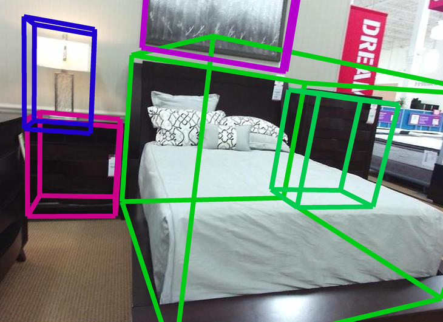 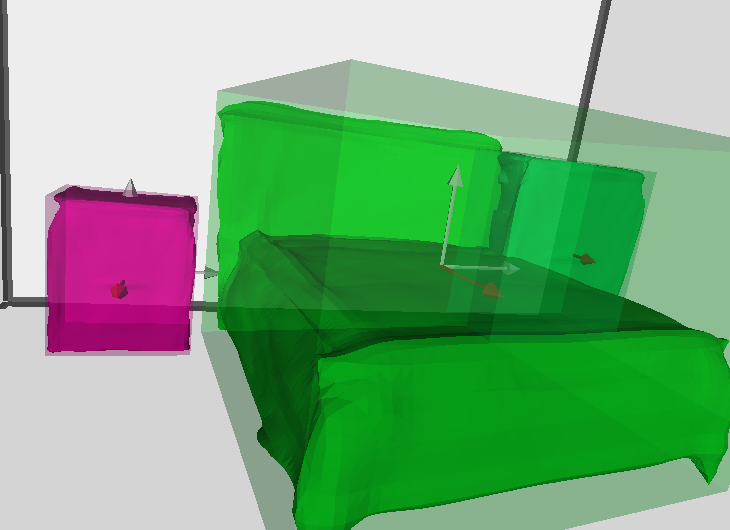

4. Visualize the detection results from a third person view with our modified matlab script from [Coop](https://github.com/thusiyuan/cooperative_scene_parsing):
    ```
    external/cooperative_scene_parsing/evaluation/vis/show_result.m
    ``` 
    Before running the script, please specify the following parameters:
    ```
    SUNRGBD_path = 'path/to/SUNRGBD';
    save_root = 'path/to/save/the/detection/results';
    paths = {
        {'path/to/save/detection/results', 'path/to/experiment/results/visualization'}, ...
        {'path/to/save/gt/boundingbox/results'}
    };
    vis_pc = false; % or true, if you want to show cloud point ground truth
    views3d = {'oblique', 'top'}; % choose prefered view
    dosave = true; % or false, please place breakpoints to interactively view the results.
    ```
    If nothing goes wrong, you should get results like:
    
    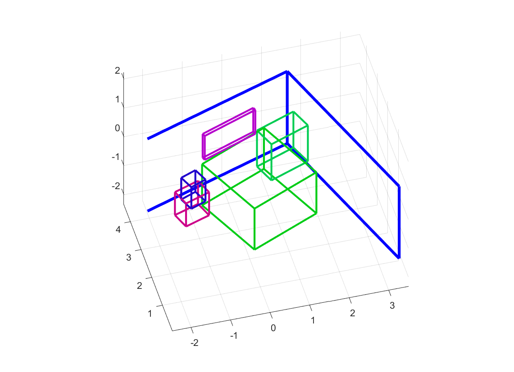

#### About the testing speed

Thanks to the simplicity of LIEN+LDIF, the pretrain takes only about 8 hours on a 1080Ti.
However, although we used the CUDA kernel of [LDIF](https://github.com/google/ldif) to optimize the speed,
the file-based interface of the kernel still bottlenecked the mesh reconstruction.
This is the main reason why our method takes much more time in object and scene mesh reconstruction.
If you want speed over mesh quality, please lower the parameter ```data.marching_cube_resolution``` in the configuration file.

## Citation

If you find our work and code helpful, please consider cite:
```
@InProceedings{Zhang_2021_CVPR,
    author    = {Zhang, Cheng and Cui, Zhaopeng and Zhang, Yinda and Zeng, Bing and Pollefeys, Marc and Liu, Shuaicheng},
    title     = {Holistic 3D Scene Understanding From a Single Image With Implicit Representation},
    booktitle = {Proceedings of the IEEE/CVF Conference on Computer Vision and Pattern Recognition (CVPR)},
    month     = {June},
    year      = {2021},
    pages     = {8833-8842}
}
```

We thank the following great works:
- [Total3DUnderstanding](https://github.com/yinyunie/Total3DUnderstanding) for their well-structured code. We construct our network based on their well-structured code.
- [Coop](https://github.com/thusiyuan/cooperative_scene_parsing) for their dataset. We used their processed dataset with 2D detector prediction.
- [LDIF](https://github.com/google/ldif) for their novel representation method. We ported their LDIF decoder from Tensorflow to PyTorch.
- [Graph R-CNN](https://github.com/jwyang/graph-rcnn.pytorch/blob/master/README.md) for their scene graph design. We adopted their GCN implemention to construct our SGCN.
- [Occupancy Networks](https://github.com/autonomousvision/occupancy_networks) for their modified version of [mesh-fusion](https://github.com/davidstutz/mesh-fusion) pipeline.

If you find them helpful, please cite:
```
@InProceedings{Nie_2020_CVPR,
author = {Nie, Yinyu and Han, Xiaoguang and Guo, Shihui and Zheng, Yujian and Chang, Jian and Zhang, Jian Jun},
title = {Total3DUnderstanding: Joint Layout, Object Pose and Mesh Reconstruction for Indoor Scenes From a Single Image},
booktitle = {IEEE/CVF Conference on Computer Vision and Pattern Recognition (CVPR)},
month = {June},
year = {2020}
}
@inproceedings{huang2018cooperative,
  title={Cooperative Holistic Scene Understanding: Unifying 3D Object, Layout, and Camera Pose Estimation},
  author={Huang, Siyuan and Qi, Siyuan and Xiao, Yinxue and Zhu, Yixin and Wu, Ying Nian and Zhu, Song-Chun},
  booktitle={Advances in Neural Information Processing Systems},
  pages={206--217},
  year={2018}
}	
@inproceedings{genova2020local,
    title={Local Deep Implicit Functions for 3D Shape},
    author={Genova, Kyle and Cole, Forrester and Sud, Avneesh and Sarna, Aaron and Funkhouser, Thomas},
    booktitle={Proceedings of the IEEE/CVF Conference on Computer Vision and Pattern Recognition},
    pages={4857--4866},
    year={2020}
}
@inproceedings{yang2018graph,
    title={Graph r-cnn for scene graph generation},
    author={Yang, Jianwei and Lu, Jiasen and Lee, Stefan and Batra, Dhruv and Parikh, Devi},
    booktitle={Proceedings of the European Conference on Computer Vision (ECCV)},
    pages={670--685},
    year={2018}
}
@inproceedings{mescheder2019occupancy,
  title={Occupancy networks: Learning 3d reconstruction in function space},
  author={Mescheder, Lars and Oechsle, Michael and Niemeyer, Michael and Nowozin, Sebastian and Geiger, Andreas},
  booktitle={Proceedings of the IEEE Conference on Computer Vision and Pattern Recognition},
  pages={4460--4470},
  year={2019}
}
```


